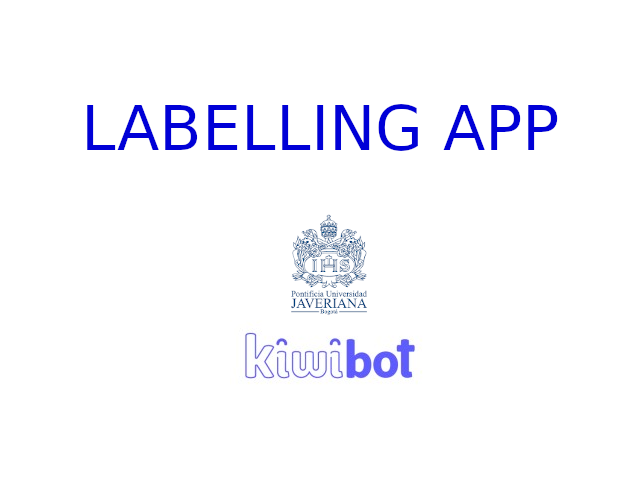
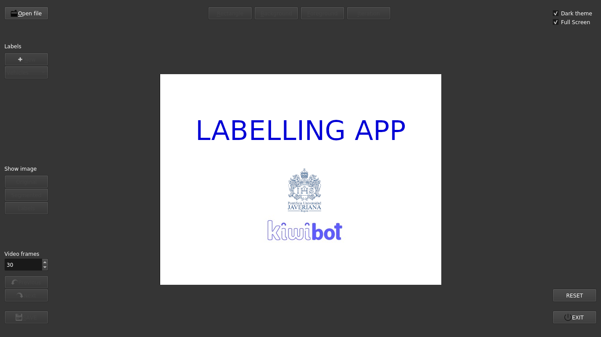
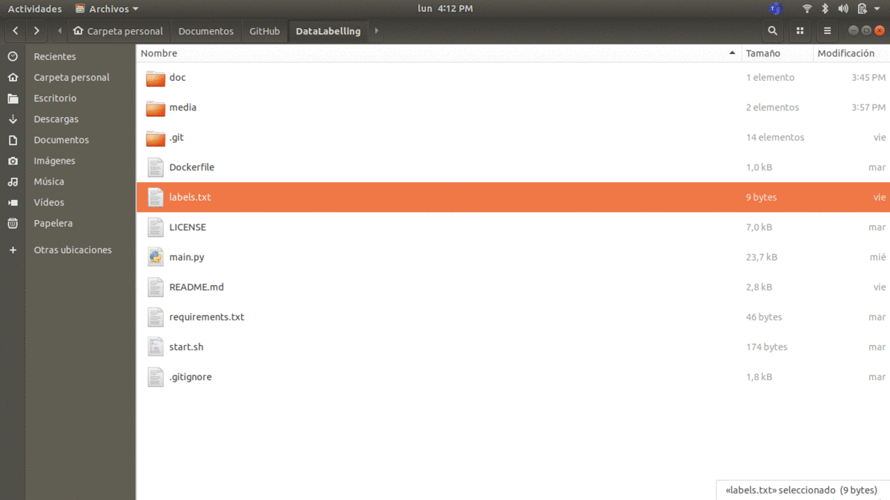
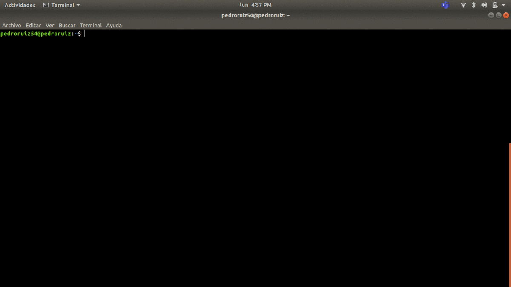

<h1 align="center"> Image Labelling App </h1>
<h5 align="center">An image labelling application to use in neural network training.</h5>

Considering the impact on the world of artificial intelligence and process automation in recent years, semi-autonomous systems have been developed that act responding to signals from their environment. An example is food delivery robots that establish their trajectory from images of their surroundings. To develop a system like this it is necessary to make use of segmentation algorithms trained to recognize obstacles, and to train these algorithms, databases of segmented images corresponding to the environment in which the robot will operate are required.

To facilitate the image segmentation process, the application based on [GrabCut](https://docs.opencv.org/master/d8/d83/tutorial_py_grabcut.html) available in this repository was developed.

**Status**: In development (code updates may be submitted after publication)

---
### ***Install Image Labelling App***

For the installation is necessary to clone the current repository in a local repository. If you don't have GitHub installed yet, you should.
If you are on Linux you can run the following command:

	sudo apt-get install git

Now you need to configure GitHub. For this run the following commands:

	git config --global user.name "user_name"
	git config --global user.email "email_id"

Otherwise, if you are not working on Linux, you can install GitHub from the [official website](https://desktop.github.com/). 

After installing and configuring GitHub on your computer, you must clone the repository. If you are on Linux, from the terminal you must access the path where you want the repository to be cloned and execute the following command:

	git clone https://github.com/Kiwi-PUJ/DataLabelling.git

*If you are not working on Linux you must clone the repository from the GitHub application.*

**Now the application files will be on your device.**

---
### ***Build and Run Docker Image***

The Image Labelling App dependencies, compilation, and configuration are packaged in a Docker Image. Before continuing, make sure you have Docker installed on your device. If it is not installed you can do it by visiting the [official website](https://docs.docker.com/get-docker/).

To run the Image Labelling App Docker image, verify that you are on the **DataLabelling** path and run the following command:

	bash start.sh

If it's the first time probably is going to take a while.

If all goes well, you should be seeing what is shown in the following image on your screen:

---
<h2 align="center">How to use?</h3>

After the application is launched and what is shown in the previous image appears on the screen, the application is ready to start using. But before continuing, let's save the images to tag in the recommended folder, which is located in the project folder *-> DataLabelling -> media -> inputs*. After this we are going to introduce the labels that we want to generate. For this we are going to find the file *labels.txt* and we are going to open it. After opening, we are going to write each of the labels, separating each one with a new line (enter). When the labels are ready, we proceed to save the changes and exit the text editor. 

Then, we can open the application by following the steps that had already been mentioned.

Once the application is open, we will have the main menu on the screen. Some of the buttons on the graphical interface have shortcuts that we can see in the following table: 

| **Button** | **Shortcut** |
|:-----------|:------------:|
|Open file   |Ctrl + O      |
|Rectangle   |Ctrl + R      |
|Background  |Ctrl + B      |
|Foreground  |Ctrl + F      |
|Iteration   |Ctrl + I      |
|New         |Ctrl + N      |
|Open file   |Ctrl + O      |
|Previous    |Ctrl + Left   |
|Next        |Ctrl + Right  |
|SAVE        |Ctrl + S      |

